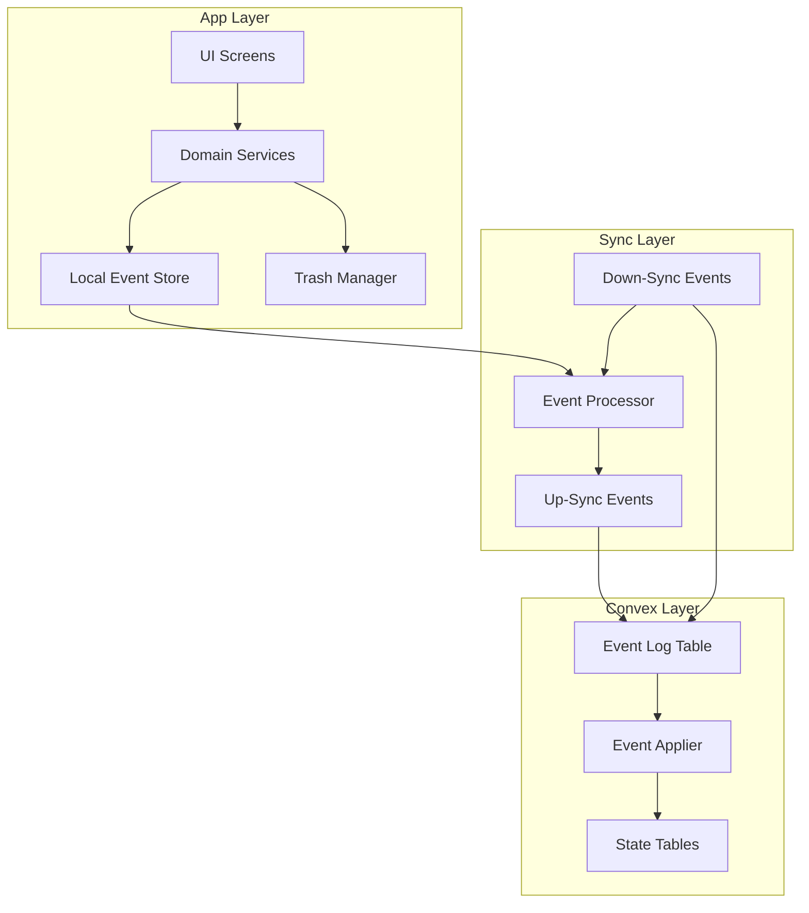
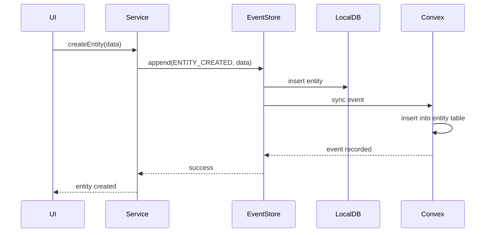
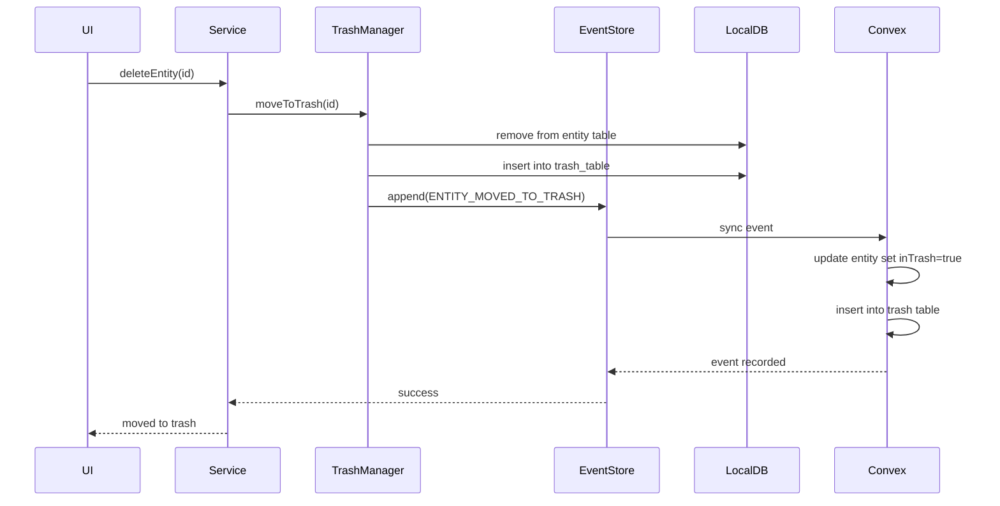
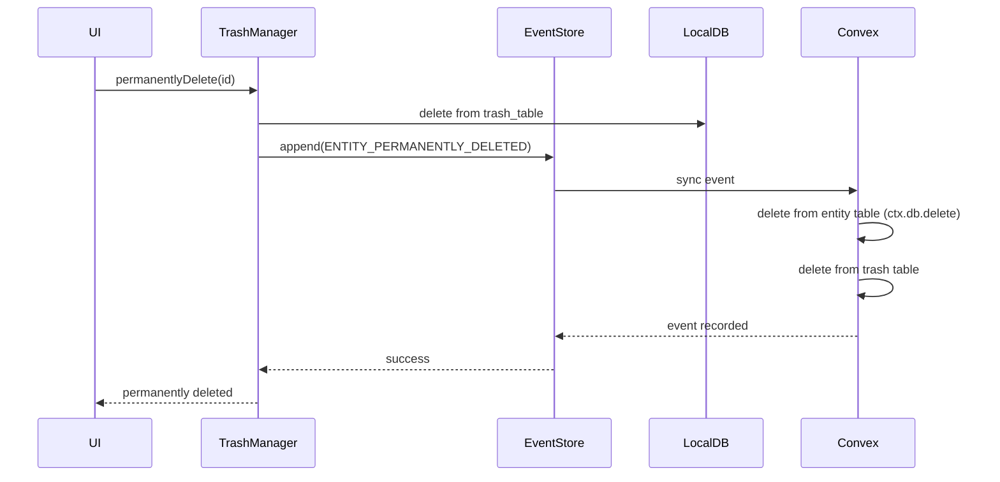
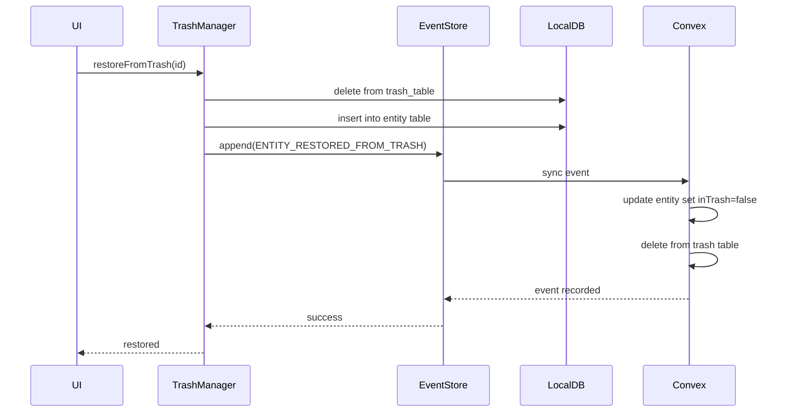

# Event-Sourced Architecture with Trash Feature

## Problem Statement

The current system has a fundamental mismatch between the app's data state and the Convex dashboard:

1. **Soft deletes persist in Convex**: When users delete items in the app, they remain in Convex with `isDeleted: true`, cluttering the dashboard
2. **No user-controlled permanent deletion**: Users have no way to permanently remove data from both app and Convex
3. **CRUD-based sync conflicts**: The current last-write-wins approach can lose data and makes conflict resolution unpredictable
4. **No audit trail of user intent**: The system records state changes but not the user's intent (create, move to trash, permanently delete)

## Proposed Solution

Design an **event-sourced architecture** with a **two-stage deletion** (soft delete → trash → permanent delete) that gives users full control over data lifecycle while keeping Convex dashboard in sync with the app's real state.

---

## Architecture Overview



---

## Core Concepts

### 1. Event Sourcing

Instead of syncing document state directly, the system synces **events** that describe user actions. Each event is immutable and represents a single user intent.

**Event Types:**
- `ENTITY_CREATED` - New entity created
- `ENTITY_UPDATED` - Entity data modified
- `ENTITY_MOVED_TO_TRASH` - Entity moved to trash (soft delete)
- `ENTITY_RESTORED_FROM_TRASH` - Entity restored from trash
- `ENTITY_PERMANENTLY_DELETED` - Entity permanently removed from everywhere
- `TRASH_EMPTIED` - All trash items permanently deleted

### 2. Two-Stage Deletion

```
Active Data → Trash → Permanently Deleted
   (soft delete)    (hard delete)
```

**Stage 1: Move to Trash**
- User deletes an item → item moves to Trash
- Item is hidden from main UI but visible in Trash
- Event: `ENTITY_MOVED_TO_TRASH`
- Convex: Event logged, item marked `inTrash: true`

**Stage 2: Permanent Delete**
- User empties trash or deletes specific item from trash
- Item is permanently removed from both app and Convex
- Event: `ENTITY_PERMANENTLY_DELETED`
- Convex: Event logged, actual document deleted via `ctx.db.delete()`

### 3. Convex Dashboard Parity

The Convex dashboard will reflect the app's real state by:
- Using the event log as the source of truth
- Rebuilding state from events when needed
- Actually deleting documents when permanently deleted from trash

---

## Schema Changes

### New Convex Tables

#### `eventLog` - The Event Log (Append-Only)

```typescript
eventLog: defineTable({
  ownerId: v.string(),
  eventType: v.string(), // 'ENTITY_CREATED', 'ENTITY_UPDATED', 'ENTITY_MOVED_TO_TRASH', etc.
  entityType: v.string(), // 'subscribers', 'cabinets', 'payments', 'workers'
  entityId: v.string(), // The client's UUID for the entity
  payload: v.string(), // JSON serialized event data
  version: v.number(), // Monotonically increasing per-entity version
  occurredAt: v.number(), // Unix timestamp when event occurred
  recordedAt: v.number(), // Unix timestamp when event was recorded in Convex
  recordedBy: v.string(), // Device/client identifier
})
  .index("by_ownerId", ["ownerId"])
  .index("by_entityType_entityId", ["entityType", "entityId"])
  .index("by_occurredAt", ["occurredAt"])
  .index("by_ownerId_occurredAt", ["ownerId", "occurredAt"])
```

#### `trash` - Trash Bin (Optional, for UI state)

```typescript
trash: defineTable({
  ownerId: v.string(),
  entityType: v.string(), // 'subscribers', 'cabinets', 'payments', 'workers'
  entityId: v.string(), // The client's UUID
  entityData: v.string(), // JSON serialized snapshot of entity when moved to trash
  deletedAt: v.number(), // Unix timestamp when moved to trash
  deletedBy: v.string(), // User/device identifier
  expiresAt: v.number(), // Auto-delete after this timestamp (e.g., 30 days)
})
  .index("by_ownerId", ["ownerId"])
  .index("by_ownerId_deletedAt", ["ownerId", "deletedAt"])
```

### Modified Existing Tables

Add `inTrash` field to all entity tables:

```typescript
// Add to subscribers, cabinets, payments, workers, etc.
inTrash: v.optional(v.boolean()), // True if entity is in trash
trashMovedAt: v.optional(v.number()), // When entity was moved to trash
```

---

## Local Database Changes

### New Local Table: `events_table`

```dart
@DataClassName('EventEntry')
class EventsTable extends Table {
  TextColumn get id => text()(); // UUID
  TextColumn get eventType => text()(); // 'ENTITY_CREATED', 'ENTITY_UPDATED', etc.
  TextColumn get entityType => text()(); // 'subscribers', 'cabinets', etc.
  TextColumn get entityId => text()(); // The entity's UUID
  TextColumn get payload => text()(); // JSON serialized event data
  IntColumn get version => integer()(); // Entity version at time of event
  DateTimeColumn get occurredAt => dateTime()(); // When event occurred
  TextColumn get status => text().withDefault(const Constant('pending'))(); // 'pending', 'synced', 'failed'
  DateTimeColumn get createdAt => dateTime()();
  
  @override
  Set<Column> get primaryKey => {id};
}
```

### New Local Table: `trash_table`

```dart
@DataClassName('TrashItem')
class TrashTable extends Table {
  TextColumn get id => text()(); // UUID
  TextColumn get entityType => text()(); // 'subscribers', 'cabinets', etc.
  TextColumn get entityId => text()(); // The entity's UUID
  TextColumn get entityData => text()(); // JSON snapshot of entity
  TextColumn get ownerId => text()();
  DateTimeColumn get deletedAt => dateTime()();
  DateTimeColumn get expiresAt => dateTime()(); // Auto-delete after this
  DateTimeColumn get createdAt => dateTime()();
  DateTimeColumn get updatedAt => dateTime()();
  
  @override
  Set<Column> get primaryKey => {id};
}
```

---

## Event Flow

### Create Entity



### Move to Trash



### Permanent Delete from Trash



### Restore from Trash



---

## Convex Mutations

### New Mutations

```typescript
// mutations/events.ts
export const recordEvent = mutation({
  args: {
    eventType: v.string(),
    entityType: v.string(),
    entityId: v.string(),
    payload: v.string(),
    version: v.number(),
    occurredAt: v.number(),
    recordedBy: v.string(),
    ownerId: v.string(),
  },
  handler: async (ctx, args) => {
    // Append event to event log (always succeeds - append only)
    const eventId = await ctx.db.insert("eventLog", {
      ...args,
      recordedAt: Date.now(),
    });
    
    // Apply event to state tables
    await applyEvent(ctx, args);
    
    return { success: true, eventId };
  },
});

// Internal helper - applies an event to the appropriate state table
async function applyEvent(ctx, event) {
  switch (event.eventType) {
    case 'ENTITY_CREATED':
      await handleCreateEvent(ctx, event);
      break;
    case 'ENTITY_UPDATED':
      await handleUpdateEvent(ctx, event);
      break;
    case 'ENTITY_MOVED_TO_TRASH':
      await handleTrashEvent(ctx, event);
      break;
    case 'ENTITY_RESTORED_FROM_TRASH':
      await handleRestoreEvent(ctx, event);
      break;
    case 'ENTITY_PERMANENTLY_DELETED':
      await handlePermanentDeleteEvent(ctx, event);
      break;
  }
}

// For ENTITY_PERMANENTLY_DELETED - actually removes the document
async function handlePermanentDeleteEvent(ctx, event) {
  const { entityType, entityId } = event;
  
  // Find and delete the entity document
  const entity = await ctx.db
    .query(entityType)
    .withIndex("by_cloudId", (q) => q.eq("cloudId", entityId))
    .first();
    
  if (entity) {
    await ctx.db.delete(entity._id);
  }
  
  // Also delete from trash table if present
  const trashItem = await ctx.db
    .query("trash")
    .withIndex("by_ownerId", (q) => q.eq("ownerId", event.ownerId))
    .filter((q) => q.eq(q.field("entityId"), entityId))
    .first();
    
  if (trashItem) {
    await ctx.db.delete(trashItem._id);
  }
}
```

---

## App Layer Changes

### New Services

#### `EventService`

Manages the local event store:
- `appendEvent(type, entityType, entityId, payload)` - Add event to local store
- `getPendingEvents()` - Get events not yet synced to Convex
- `markEventSynced(eventId)` - Mark event as synced
- `replayEvents(entityType, entityId)` - Rebuild entity state from events

#### `TrashService`

Manages the trash bin:
- `moveToTrash(entityType, entityId)` - Move entity to trash
- `restoreFromTrash(entityId)` - Restore entity from trash
- `permanentlyDelete(entityId)` - Permanently delete from trash
- `emptyTrash()` - Delete all trash items
- `getTrashItems()` - List items in trash
- `getExpiredTrashItems()` - Get items past expiration date

### Modified Services

All entity services (CabinetsService, SubscribersService, etc.) need to:
1. Use `EventService.appendEvent()` instead of direct outbox entries
2. Call `TrashService.moveToTrash()` instead of soft delete
3. Remove direct Convex mutation calls (events handle sync)

### New UI Components

#### Trash Screen

Located in Settings → Trash:
- List of trashed items with delete date and expiration countdown
- "Restore" button per item
- "Delete Permanently" button per item
- "Empty Trash" button to delete all

---

## Migration Strategy

### Phase 1: Add Event Infrastructure

1. Add `eventLog` table to Convex schema
2. Add `EventsTable` to local Drift schema
3. Create `EventService` and `EventProcessor`
4. Modify existing mutations to also record events (dual-write during transition)

### Phase 2: Add Trash Feature

1. Add `trash` table to Convex schema
2. Add `TrashTable` to local Drift schema
3. Create `TrashService` and Trash UI
4. Modify delete operations to use trash instead of soft delete

### Phase 3: Migrate to Event-Only Sync

1. Switch sync to use events exclusively
2. Remove old outbox-based sync
3. Add event replay for state recovery

### Phase 4: Cleanup

1. Remove soft-delete fields from entity tables (after migration)
2. Remove old outbox table
3. Clean up deprecated code

---

## Benefits

1. **Convex Dashboard Parity**: Permanently deleted items are actually gone from Convex
2. **User Control**: Users decide when to permanently delete via trash
3. **Audit Trail**: Every action is recorded as an immutable event
4. **Conflict Resolution**: Events are append-only, eliminating write conflicts
5. **Recovery**: State can be rebuilt from events at any time
6. **Compliance**: Clear audit trail for financial operations
7. **Auto-Cleanup**: Trash items expire after configurable period (default 30 days)

---

## Implementation Checklist

### Convex Changes
- [ ] Add `eventLog` table to schema
- [ ] Add `trash` table to schema
- [ ] Add `inTrash` and `trashMovedAt` fields to entity tables
- [ ] Create `mutations/events.ts` with `recordEvent` mutation
- [ ] Create `queries/events.ts` with `getEventsSince` query
- [ ] Create `queries/trash.ts` with trash queries
- [ ] Create `mutations/trash.ts` with trash mutations
- [ ] Add cron job for auto-deleting expired trash items

### Local Database Changes
- [ ] Add `EventsTable` to Drift schema
- [ ] Add `TrashTable` to Drift schema
- [ ] Create database migration (v4 → v5)
- [ ] Create `EventsDao` and `TrashDao`

### Service Layer Changes
- [ ] Create `EventService`
- [ ] Create `TrashService`
- [ ] Modify `ConvexSyncProcessor` to use events
- [ ] Modify `ConvexDownSyncService` to sync events
- [ ] Modify all entity services to use events
- [ ] Modify `OutboxService` or replace with event-based approach

### UI Changes
- [ ] Create Trash screen
- [ ] Add Trash entry in Settings
- [ ] Modify delete dialogs to use "Move to Trash"
- [ ] Add trash count badge in Settings
- [ ] Add confirmation dialogs for permanent delete

### Testing
- [ ] Unit tests for EventService
- [ ] Unit tests for TrashService
- [ ] Integration tests for event sync
- [ ] UI tests for trash flow
- [ ] Migration tests

---

## Design Decisions (Confirmed)

1. **Trash expiration**: Auto-delete after 30 days. A Convex cron job runs daily to permanently delete trash items older than 30 days.
2. **Event retention**: Events are kept forever. This provides a complete, immutable audit trail for financial compliance.
3. **Migration**: Existing soft-deleted items (`isDeleted: true`) will be moved to trash during migration. Their `isDeleted` flag will be reset to `false` and `inTrash` set to `true`. The `trashMovedAt` will be set to the migration timestamp.
4. **Permissions**: Only the owner can permanently delete their own items. This is enforced by the `ownerId` check in all mutations.
5. **Performance**: Event replay uses indexed queries with pagination. For large datasets, periodic state snapshots can be created to avoid full replay.

## Implementation Phases

### Phase 1: Event Infrastructure (Week 1)
- Add `eventLog` table to Convex schema
- Add `EventsTable` to local Drift schema (migration v4 → v5)
- Create `EventService` for local event management
- Create `mutations/events.ts` with `recordEvent` mutation
- Create `queries/events.ts` with `getEventsSince` query
- Modify `ConvexSyncProcessor` to use events instead of outbox
- Dual-write mode: existing mutations also record events

### Phase 2: Trash Feature (Week 2)
- Add `trash` table to Convex schema
- Add `TrashTable` to local Drift schema (migration v5 → v6)
- Create `TrashService` for trash management
- Create `mutations/trash.ts` with trash operations
- Create `queries/trash.ts` with trash queries
- Add Convex cron job for auto-deleting expired trash (30 days)
- Create Trash UI screen accessible from Settings
- Modify delete operations to use trash instead of soft delete

### Phase 3: Migration (Week 3)
- Create migration script to move existing soft-deleted items to trash
- Run migration on Convex (widen-migrate-narrow pattern)
- Switch sync to use events exclusively
- Remove old outbox-based sync
- Add event replay for state recovery

### Phase 4: Cleanup (Week 4)
- Remove soft-delete fields from entity tables (after confirming migration)
- Remove old outbox table
- Clean up deprecated code
- Final testing and verification
